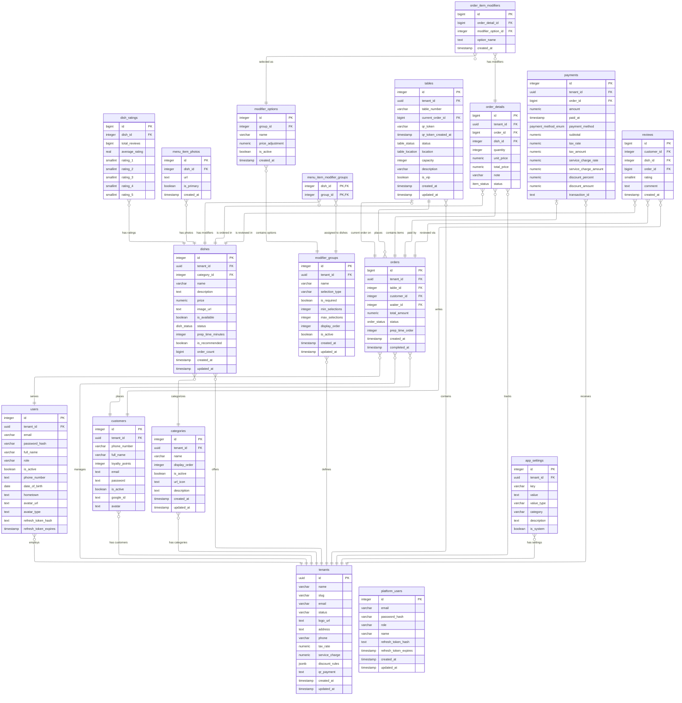

# Restaurant Database ERD
Cần tải Extension ở VScode `Markdown Preview Mermaid Support` để có thể sử dụng được biểu đồ mermaid
## Entity Relationship Diagram

```mermaid
---
config:
  layout: elk
---
erDiagram
    direction BT
    tenants {
        uuid id PK
        varchar name
        varchar slug
        varchar email
        varchar status
        text logo_url
        text address
        varchar phone
        numeric tax_rate
        numeric service_charge
        jsonb discount_rules
        text qr_payment
        timestamp created_at
        timestamp updated_at
    }

    app_settings {
        integer id PK
        uuid tenant_id FK
        varchar key
        text value
        varchar value_type
        varchar category
        text description
        boolean is_system
    }

    platform_users {
        integer id PK
        varchar email
        varchar password_hash
        varchar role
        varchar name
        text refresh_token_hash
        timestamp refresh_token_expires
        timestamp created_at
        timestamp updated_at
    }

    users {
        integer id PK
        uuid tenant_id FK
        varchar email
        varchar password_hash
        varchar full_name
        varchar role
        boolean is_active
        text phone_number
        date date_of_birth
        text hometown
        text avatar_url
        text avatar_type
        text refresh_token_hash
        timestamp refresh_token_expires
    }

    customers {
        integer id PK
        uuid tenant_id FK
        varchar phone_number
        varchar full_name
        integer loyalty_points
        text email
        text password
        boolean is_active
        text google_id
        text avatar
    }

    categories {
        integer id PK
        uuid tenant_id FK
        varchar name
        integer display_order
        boolean is_active
        text url_icon
        text description
        timestamp created_at
        timestamp updated_at
    }

    dishes {
        integer id PK
        uuid tenant_id FK
        integer category_id FK
        varchar name
        text description
        numeric price
        text image_url
        boolean is_available
        dish_status status
        integer prep_time_minutes
        boolean is_recommended
        bigint order_count
        timestamp created_at
        timestamp updated_at
    }

    dish_ratings {
        bigint id PK
        integer dish_id FK
        bigint total_reviews
        real average_rating
        smallint rating_1
        smallint rating_2
        smallint rating_3
        smallint rating_4
        smallint rating_5
    }

    menu_item_photos {
        integer id PK
        integer dish_id FK
        text url
        boolean is_primary
        timestamp created_at
    }

    modifier_groups {
        integer id PK
        uuid tenant_id FK
        varchar name
        varchar selection_type
        boolean is_required
        integer min_selections
        integer max_selections
        integer display_order
        boolean is_active
        timestamp created_at
        timestamp updated_at
    }

    modifier_options {
        integer id PK
        integer group_id FK
        varchar name
        numeric price_adjustment
        boolean is_active
        timestamp created_at
    }

    menu_item_modifier_groups {
        integer dish_id PK,FK
        integer group_id PK,FK
    }

    tables {
        integer id PK
        uuid tenant_id FK
        varchar table_number
        bigint current_order_id FK
        varchar qr_token
        timestamp qr_token_created_at
        table_status status
        table_location location
        integer capacity
        varchar description
        boolean is_vip
        timestamp created_at
        timestamp updated_at
    }

    orders {
        bigint id PK
        uuid tenant_id FK
        integer table_id FK
        integer customer_id FK
        integer waiter_id FK
        numeric total_amount
        order_status status
        integer prep_time_order
        timestamp created_at
        timestamp completed_at
    }

    order_details {
        bigint id PK
        uuid tenant_id FK
        bigint order_id FK
        integer dish_id FK
        integer quantity
        numeric unit_price
        numeric total_price
        varchar note
        item_status status
    }

    order_item_modifiers {
        bigint id PK
        bigint order_detail_id FK
        integer modifier_option_id FK
        text option_name
        timestamp created_at
    }

    payments {
        integer id PK
        uuid tenant_id FK
        bigint order_id FK
        numeric amount
        timestamp paid_at
        payment_method_enum payment_method
        numeric subtotal
        numeric tax_rate
        numeric tax_amount
        numeric service_charge_rate
        numeric service_charge_amount
        numeric discount_percent
        numeric discount_amount
        text transaction_id
    }

    reviews {
        bigint id PK
        integer customer_id FK
        integer dish_id FK
        bigint order_id FK
        smallint rating
        text comment
        timestamp created_at
    }

    tenants ||--o{ app_settings: "has settings"
    tenants ||--o{ users: "employs"
    tenants ||--o{ customers: "has customers"
    tenants ||--o{ categories: "has categories"
    tenants ||--o{ dishes: "offers"
    tenants ||--o{ modifier_groups: "defines"
    tenants ||--o{ tables: "contains"
    tenants ||--o{ orders: "manages"
    tenants ||--o{ order_details: "tracks"
    tenants ||--o{ payments: "receives"
    categories ||--o{ dishes: "categorizes"
    dishes ||--o{ dish_ratings: "has ratings"
    dishes ||--o{ menu_item_photos: "has photos"
    dishes ||--o{ menu_item_modifier_groups: "has modifiers"
    dishes ||--o{ order_details: "is ordered in"
    dishes ||--o{ reviews: "is reviewed in"
    modifier_groups ||--o{ modifier_options: "contains options"
    modifier_groups ||--o{ menu_item_modifier_groups: "assigned to dishes"
    tables ||--o{ orders: "places"
    orders ||--o| tables: "current order on"
    customers ||--o{ orders: "places"
    customers ||--o{ reviews: "writes"
    users ||--o{ orders: "serves"
    orders ||--o{ order_details: "contains items"
    orders ||--o| payments: "paid by"
    orders ||--o{ reviews: "reviewed via"
    order_details ||--o{ order_item_modifiers: "has modifiers"
    modifier_options ||--o{ order_item_modifiers: "selected as"
```